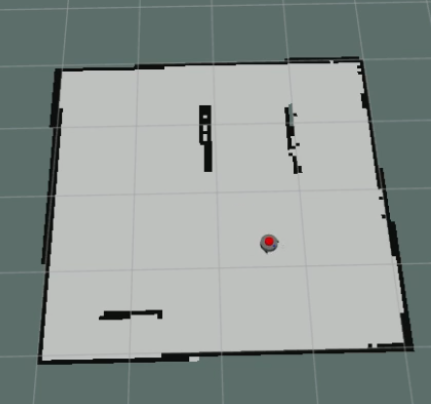
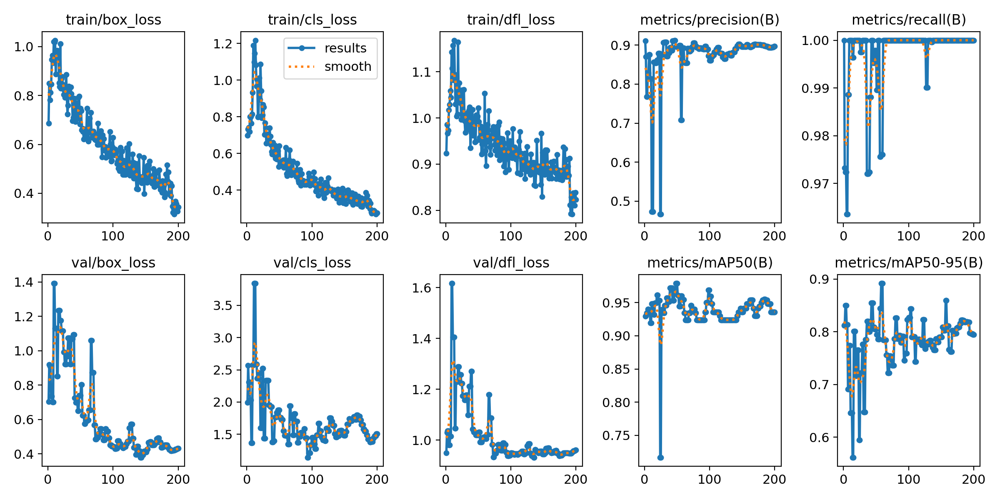
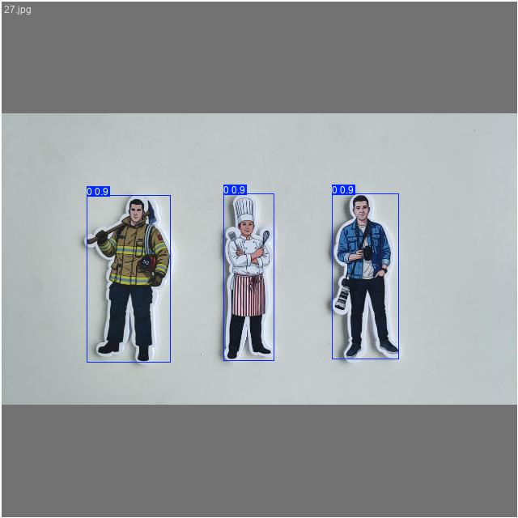
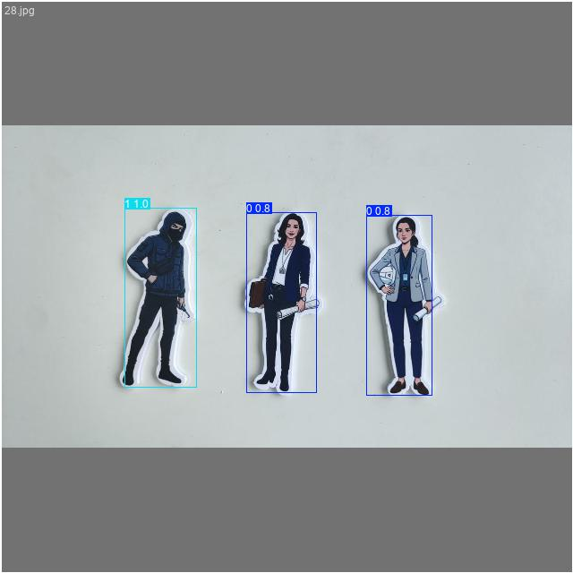
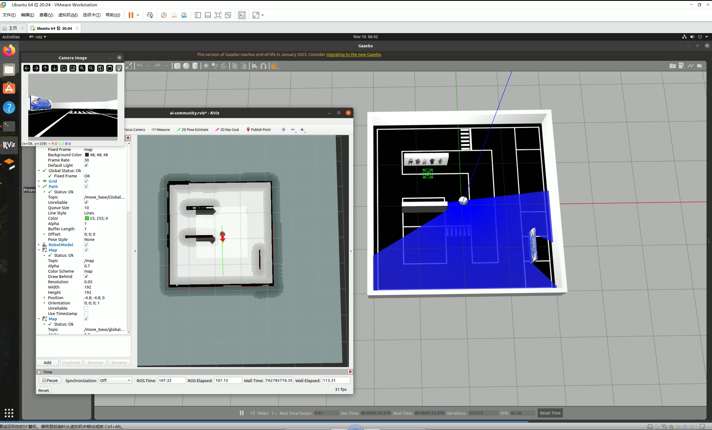
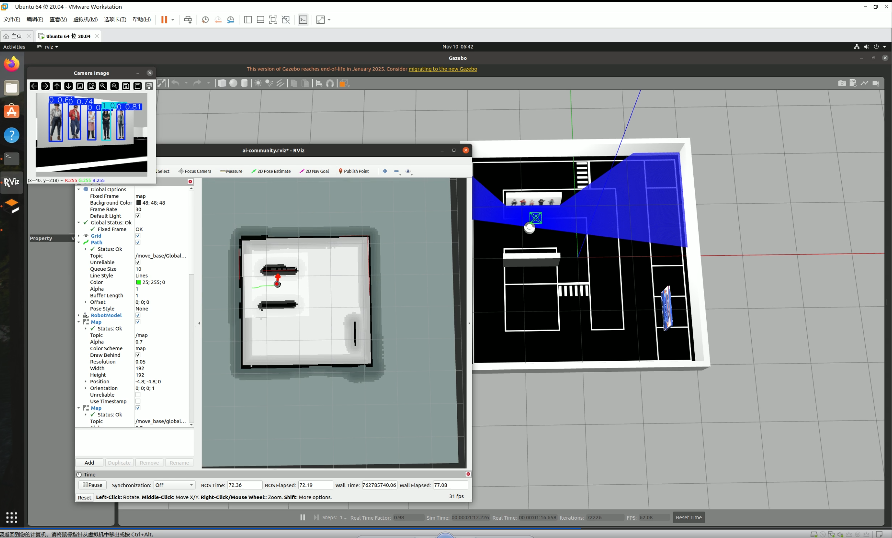

# ROS-Differential-Robot

## Introduction

The ROS project becomes from my work for AIC-Competion.Accomplished functions include gazebo,SLAM mapping,navigation,YOLO for crowd and EasyOCR for car plate.

## Related Work

## SLAM

### Navigation

### YOLO

Using YOLOv5su pretrained model from Ultralytics and trained on NVIDIA Geforce 4060 Laptop.

## Show

